# Mini Projet de Synthèse

## Déploiement du mini-projet

Assurez-vous d'être à la racine du projet, puis suivez les étapes ci-dessous :

1. **Initialiser Docker Swarm** :
   ```bash
   docker swarm init
   ```
   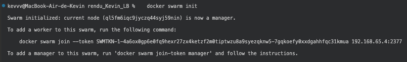

2. **Créer le réseau `web`** :
   ```bash
   docker network create --driver=overlay web
   ```
   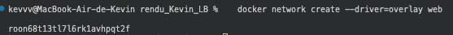

3. **Construire les images** :
   ```bash
   docker compose build
   ```
   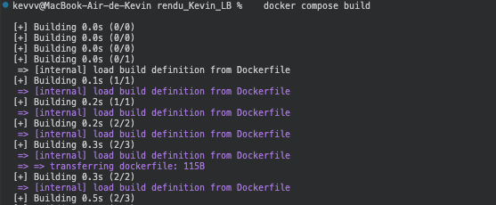

4. **Déployer la stack** :
   ```bash
   docker stack deploy -c docker-compose.yml mini_projet
   ```
   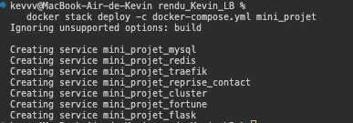

5. **Lancer le projet** :
   ```bash
   docker-compose up -d
   ```

## Test du projet

1. Vérifiez que les services sont en cours d'exécution avec la commande suivante :
   ```bash
   docker stack ps mini_projet
   ```
   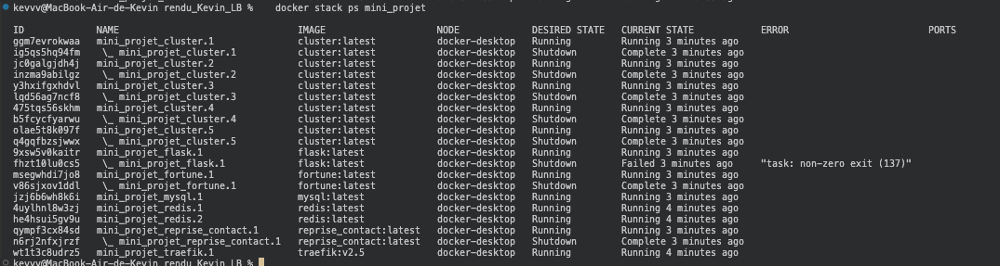

2. Testez chaque URL pour accéder aux services :
   - **Traefik** : `http://traefik.localhost`
   - **Reprise de contact** : `http://reprise.localhost`
   - **Cluster Swarm** : `http://cluster.localhost`
   - **Application Fortune Images** : `http://fortune.localhost`
   - **Flask** : `http://flask.localhost`

Toutes les pages devraient s'afficher correctement, sauf Flask en raison d'une erreur.

## Résultats

### **Traefik :**
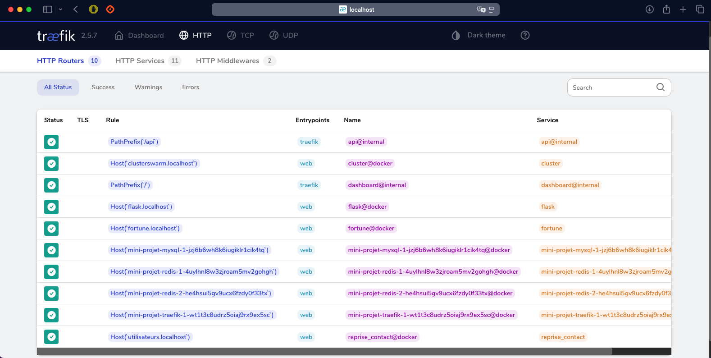

### **Reprise de contact :**
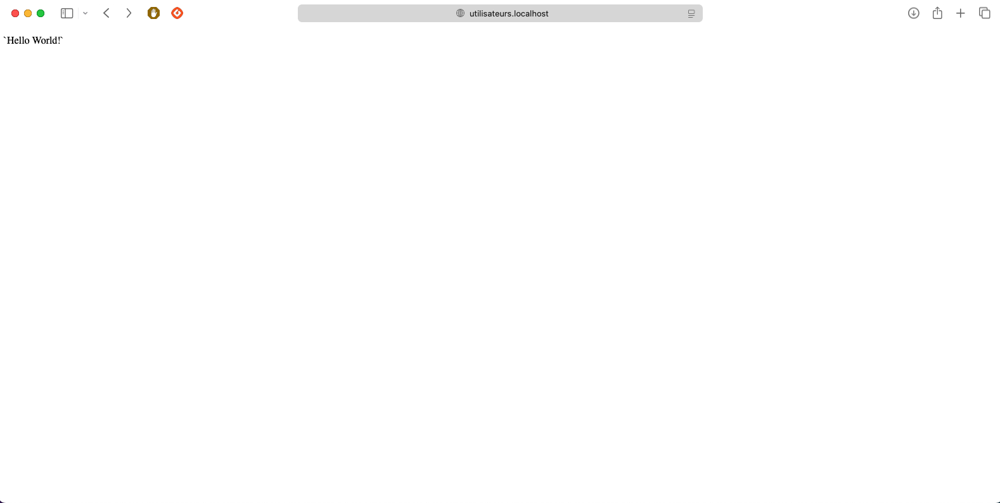

### **Cluster Swarm :**
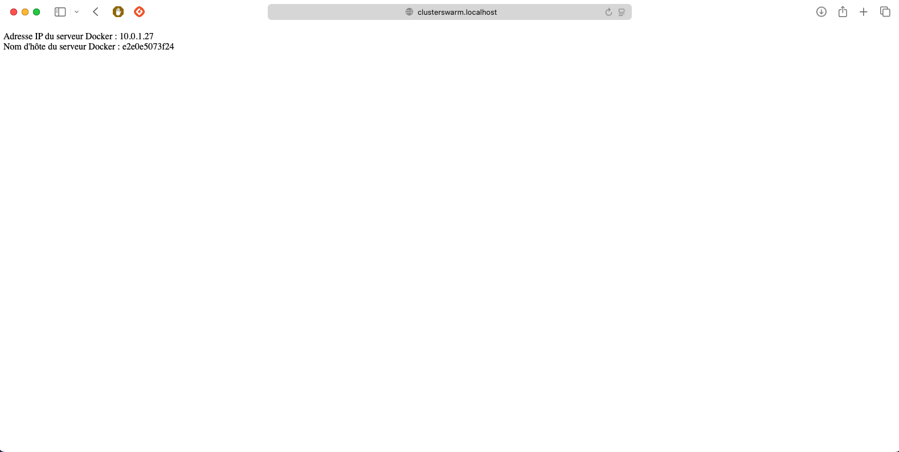

### **Fortune Images :**
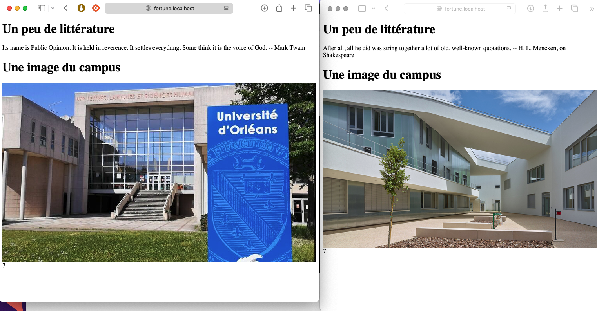

### **Flask :**
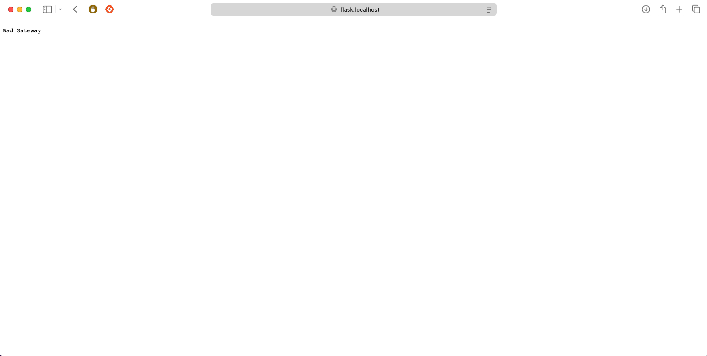

## Problèmes rencontrés

### **Problème 1 : Service Flask et Redis**
Le premier problème concernait le service Flask et Redis. Une erreur 404 s'affichait lors de l'accès à `http://flask.localhost`.  
Lorsque j'exécutais `docker compose up -d`, Redis ne se lançait pas.  

J'ai tenté plusieurs solutions :  
- Ajout de `depends_on` dans le service Flask pour forcer le démarrage de Redis avant Flask.  
- Ajout de `restart: always` pour relancer Redis en cas d'erreur.  

Malheureusement, aucune de ces solutions n'a fonctionné. J'ai donc décidé de revenir à la configuration initiale et de laisser l'erreur, sans que cela n'affecte le reste du projet.

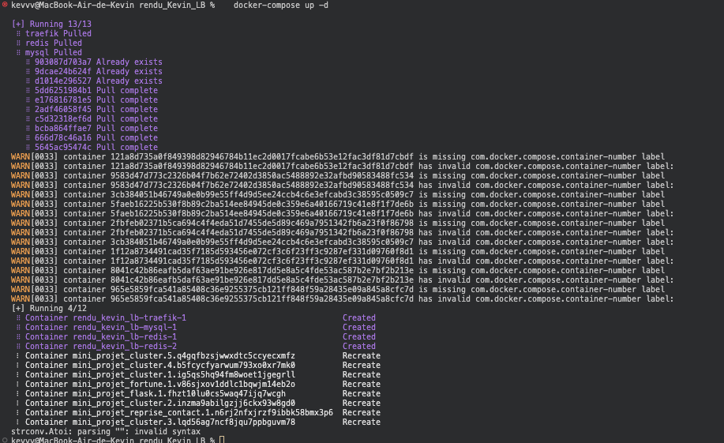

### **Problème 2 : Accès aux adresses `localhost` sur Mac**
Un problème spécifique à macOS empêchait l'accès aux adresses `localhost`.  
Pour contourner ce problème, il faut modifier le fichier `hosts` avec la commande suivante :

```bash
sudo nano /etc/hosts
```

Puis, ajoutez cette ligne au fichier :

```plaintext
127.0.0.1 traefik.localhost reprise.localhost cluster.localhost fortune.localhost flask.localhost
```

### **Problème 3 : Déploiement sur les machines de l'IUT**
Le principal problème rencontré était l'impossibilité de déployer le projet sur les machines de l'IUT.  
N'ayant pas pu accéder à mon compte sur ces machines, je n'ai jamais pu déployer le projet sur les machines virtuelles.  

J'ai donc pris la décision de le déployer sur mon ordinateur personnel et de présenter les résultats sous forme de captures d'écran.